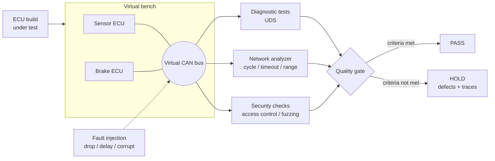

<div align="center">

# ecu-quality-gate

**An automated release gate for vehicle ECU software.<br>Diagnostics, network behavior and security are verified on a virtual bench,<br>and every build ends with a verdict backed by evidence.**

[](https://github.com/eungyun-im/ecu-quality-gate/actions/workflows/gate.yml)


[Overview](#overview) · [Architecture](#architecture) · [What is verified](#what-is-verified) · [Seeded defects](#seeded-defects) · [Gate](#the-gate) · [Layout](#repository-layout) · [Run](#running)

</div>

---

## Overview

Before a vehicle program moves to its next stage, someone has to answer one question about each ECU software build: **is it good enough to go on?**

This project automates that answer for a small virtual vehicle network. A build of the ECU software is loaded onto a virtual bench, exercised through its diagnostic interface, observed on the bus, and probed for security weaknesses. The results are reduced to a single verdict, `PASS` or `HOLD`, with the failing requirement, the defect, and the trace that proves it.

No simulator or hardware is required. The bench, the ECUs and the bus all run in one Python process or one container.

> **Status:** work in progress. The requirements, network definition, gate criteria and project structure are in place. The virtual ECUs, test suites and analyzer are being implemented.

## Architecture



## What is verified

### Diagnostics (UDS)

| ID | Requirement |
|---|---|
| DIAG-01 | ECU starts in the default session. `0x10 03` enters the extended session with a positive response. |
| DIAG-02 | Without TesterPresent for 5 s, the ECU falls back to the default session. |
| DIAG-03 | `0x22` returns data for a known DID, NRC `0x31` for an unknown DID, NRC `0x13` for a wrong length. |
| DIAG-04 | `0x2E` is accepted only in the extended session with security unlocked. |
| DIAG-05 | `0x19 02` reports stored DTCs. `0x14` clears them. |
| DIAG-06 | `0x11 01` resets the ECU and returns it to the default session. |

### Network behavior

| ID | Requirement |
|---|---|
| NET-01 | Each periodic message stays within ±10 % of its nominal cycle time. |
| NET-02 | A message missing for more than 3 cycles makes the receiver store a timeout DTC. |
| NET-03 | Every signal stays inside its declared range. |

### Security

| ID | Requirement |
|---|---|
| SEC-01 | A wrong key returns NRC `0x35`. Three wrong keys in a row lock access for 10 s. |
| SEC-02 | Write services are rejected with NRC `0x33` while security is locked. |
| SEC-03 | The security seed changes on every request. A replayed seed and key pair does not unlock. |
| SEC-04 | An ECU reset or session change does not clear the failed-attempt counter. |
| SEC-05 | Under random and malformed requests, the ECU keeps answering and keeps its bus timing. |

Each security requirement is derived from a concrete way to abuse the diagnostic interface: key guessing, replay, lockout bypass, fuzzing. See [`docs/security_test_design.md`](docs/security_test_design.md).

Full text: [`requirements/requirements.md`](requirements/requirements.md) · Network definition: [`network/messages.yaml`](network/messages.yaml)

## Seeded defects

A gate that has never caught anything proves nothing. The repository carries two builds of the same ECU software:

| Build | Purpose |
|---|---|
| [`builds/v1.0.0.yaml`](builds/v1.0.0.yaml) | Reference build that meets every requirement |
| [`builds/v1.1.0.yaml`](builds/v1.1.0.yaml) | Build with defects planted on purpose |

The planted defects are the kind that slip through a quick functional check: a message that drifts off its cycle time, a write service that works in the wrong session, a security seed that never changes, a request that makes the ECU stop answering. The gate must pass the first build and hold the second, naming each planted defect.

## The gate

Criteria live in [`requirements/gate_criteria.yaml`](requirements/gate_criteria.yaml).

| Criterion | Threshold |
|---|---|
| Requirement coverage | 100 % of requirements have at least one executed test |
| Critical defects open | 0 |
| Major defects open | 0 |
| Minor defects open | at most 3 |
| Tests blocked or not run | 0 |

The report gives the verdict first, then the evidence:

```
BUILD      <version>
VERDICT    PASS | HOLD

REQUIREMENT   TESTS   RESULT   DEFECT
DIAG-01       ...     ...      ...
NET-01        ...     ...      ...
SEC-01        ...     ...      ...

DEFECTS
<id>  <severity>  <requirement>  <one-line symptom>  <trace file>
```

Each defect is filed with the template in [`docs/defect_template.md`](docs/defect_template.md).

### Results store

Every run is recorded in a SQLite database: builds, requirements, test results and defects ([`store/schema.sql`](store/schema.sql)). The gate criteria are evaluated as SQL queries over that history, so the same data answers both "can this build go on" and "what changed since the last build".

| Query | Answers |
|---|---|
| [`requirement_coverage.sql`](store/queries/requirement_coverage.sql) | Share of requirements with an executed test |
| [`open_defects_by_severity.sql`](store/queries/open_defects_by_severity.sql) | Open defects per severity for a build |
| [`regression_between_builds.sql`](store/queries/regression_between_builds.sql) | Tests that passed before and fail now |
| [`pass_rate_trend.sql`](store/queries/pass_rate_trend.sql) | Pass rate per build and requirement category |

## Repository layout

```
ecu-quality-gate/
├── requirements/        Requirements and gate criteria
├── network/             Message and signal definitions
├── builds/              ECU build configurations (reference and seeded)
├── ecus/                Virtual ECUs
├── bench/               Virtual bus, UDS client, fault injection, fuzzer
├── analyzer/            Trace parsing and network checks
├── gate/                Verdict and report
├── store/               SQLite schema and gate queries
├── tests/
│   ├── diag/            DIAG requirements
│   ├── network/         NET requirements
│   ├── security/        SEC requirements
│   └── analyzer/        Tests for the analyzer itself
├── traces/              Recorded bus traces
├── docs/                Architecture notes, defect template
├── Dockerfile
└── .github/workflows/   Gate pipeline
```

## Running

```bash
pip install -r requirements.txt
pytest -v
```

Or in a container:

```bash
docker build -t ecu-quality-gate .
```

```bash
docker run --rm ecu-quality-gate
```

## Roadmap

**Core**

- [ ] Virtual bus with a simulated clock and trace recording
- [ ] Virtual ECUs with the UDS services in the requirements
- [ ] Diagnostic, network and security test suites, one test per requirement
- [ ] Trace analyzer: cycle time, timeout, signal range
- [ ] Diagnostic fuzzer with replayable seeds
- [ ] Results store in SQLite, gate criteria as SQL queries
- [ ] Gate verdict and report
- [ ] Reference build passes, seeded build is held with every planted defect named

**Next**

- [ ] Build-to-build regression comparison: new failures, new defects, fixed defects

**Later**

- [ ] Quality trend dashboard across builds
- [ ] OTA update verification: interrupted update, bad signature, downgrade, rollback
- [ ] DBC import for the network definition
- [ ] ISO-TP multi-frame diagnostics
- [ ] Root-cause classification of defects

## Standards referenced

ISO 14229 (UDS) · ISO 11898 (CAN) · ISO 26262 · ISO/SAE 21434 · UN R155 · Automotive SPICE (SWE.4 to SWE.6) · ISTQB CTFL v4.0

## Related

- [automotive-sw-qa](https://github.com/eungyun-im/automotive-sw-qa): requirement-based test design and regression testing for an AEB function
- [llm-testcase-review](https://github.com/eungyun-im/llm-testcase-review): rule checks and human review for LLM-generated test cases
