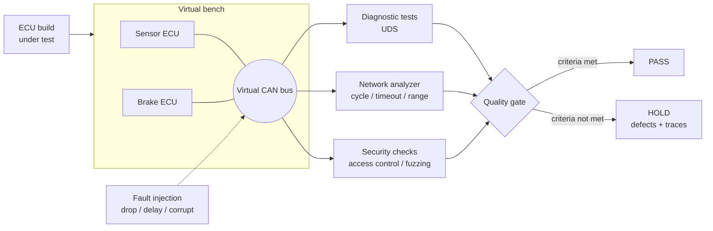

<div align="center">

# ecu-quality-gate

**An automated release gate for vehicle ECU software.<br>Diagnostics, network behavior and security are verified on a virtual bench,<br>and every build ends with a verdict backed by evidence.**

[](https://github.com/eungyun-im/ecu-quality-gate/actions/workflows/gate.yml)


[Overview](#overview) · [Architecture](#architecture) · [What is verified](#what-is-verified) · [Diagnostic stack](#standard-diagnostic-stack) · [Seeded defects](#seeded-defects) · [Gate](#the-gate) · [Layout](#repository-layout) · [Run](#running)

</div>

---

## Overview

Before a vehicle program moves to its next stage, someone has to answer one question about each ECU software build: **is it good enough to go on?**

This project automates that answer for a small virtual vehicle network. A build of the ECU software is loaded onto a virtual bench, exercised through its diagnostic interface, observed on the bus, and probed for security weaknesses. The results are reduced to a single verdict, `PASS` or `HOLD`, with the failing requirement, the defect, and the trace that proves it.

No simulator or hardware is required. The bench, the ECUs and the bus all run in one Python process or one container.

> **Status:** the virtual bench, both ECUs, the UDS server, the fuzzer, the analyzer, the results store and 48 requirement tests are implemented. Diagnostics run over a standard ISO-TP and UDS stack (can-isotp, udsoncan), on the simulated bus and on a real CAN interface. The suites pass the reference build and catch all seven planted defects. The final step, turning results into `PASS` or `HOLD` ([`gate/verdict.py`](gate/verdict.py)), and three of the four SQL queries are open, so the report currently ends in `PENDING`.

## Architecture



## What is verified

### Diagnostics (UDS)

| ID | Requirement |
|---|---|
| DIAG-01 | ECU starts in the default session. `0x10 03` enters the extended session with a positive response. |
| DIAG-02 | Without TesterPresent for 5 s, the ECU falls back to the default session. |
| DIAG-03 | `0x22` returns data for a known DID, NRC `0x31` for an unknown DID, NRC `0x13` for a wrong length. |
| DIAG-04 | `0x2E` is accepted only in the extended session with security unlocked. |
| DIAG-05 | `0x19 02` reports stored DTCs. `0x14` clears them. |
| DIAG-06 | `0x11 01` resets the ECU and returns it to the default session. |

### Network behavior

| ID | Requirement |
|---|---|
| NET-01 | Each periodic message stays within ±10 % of its nominal cycle time. |
| NET-02 | A message missing for more than 3 cycles makes the receiver store a timeout DTC. |
| NET-03 | Every signal stays inside its declared range. |

### Security

| ID | Requirement |
|---|---|
| SEC-01 | A wrong key returns NRC `0x35`. Three wrong keys in a row lock access for 10 s. |
| SEC-02 | Write services are rejected with NRC `0x33` while security is locked. |
| SEC-03 | The security seed changes on every request. A replayed seed and key pair does not unlock. |
| SEC-04 | An ECU reset or session change does not clear the failed-attempt counter. |
| SEC-05 | Under random and malformed requests, the ECU keeps answering and keeps its bus timing. |

Each security requirement is derived from a concrete way to abuse the diagnostic interface: key guessing, replay, lockout bypass, fuzzing. See [`docs/security_test_design.md`](docs/security_test_design.md).

Full text: [`requirements/requirements.md`](requirements/requirements.md) · Network definition: [`network/messages.yaml`](network/messages.yaml)

## Standard diagnostic stack

The diagnostic link uses the same open-source stack an engineer would use against a real ECU:

| Layer | Implementation |
|---|---|
| UDS client (ISO 14229) | [udsoncan](https://github.com/pylessard/python-udsoncan), which builds every request and parses every response |
| Transport (ISO 15765-2, ISO-TP) | [can-isotp](https://github.com/pylessard/python-can-isotp): single frames, first frames, consecutive frames, flow control |
| CAN | The simulated bus in tests, or any [python-can](https://github.com/hardbyte/python-can) interface in live mode |

A raw byte-level client is kept next to udsoncan for the cases a well-behaved client cannot produce: wrong lengths, malformed requests and fuzzing.

**Live mode.** The same ECU code also runs in real time on a real CAN interface, so standard tools can watch it. On Linux with a virtual CAN interface:

```bash
python -m bench.live ecu --interface socketcan --channel vcan0
```

```bash
python -m bench.live tester --interface socketcan --channel vcan0
```

`candump vcan0` during that session, diagnostic frames only, with notes added on the right. Reading the 17-character VIN takes five frames:

```
 (001.532991)  vcan0  7E0   [8]  03 22 F1 90 00 00 00 00    request: ReadDataByIdentifier F190
 (001.533477)  vcan0  7E8   [8]  10 14 62 F1 90 4B 4D 55    first frame, 20 bytes follow
 (001.533862)  vcan0  7E0   [8]  30 00 00 00 00 00 00 00    flow control: continue
 (001.534043)  vcan0  7E8   [8]  21 45 43 55 47 41 54 45    consecutive frame 1
 (001.534156)  vcan0  7E8   [8]  22 30 30 30 30 30 30 31    consecutive frame 2
 (001.536145)  vcan0  7E0   [8]  02 10 03 00 00 00 00 00    request: extended session
 (001.536447)  vcan0  7E8   [8]  06 50 03 00 32 01 F4 00    positive, P2 = 50 ms, P2* = 5000 ms
 (001.537318)  vcan0  7E0   [8]  02 27 01 00 00 00 00 00    request seed
 (001.537752)  vcan0  7E8   [8]  04 67 01 4A CD 00 00 00    seed 4ACD
 (001.538486)  vcan0  7E0   [8]  04 27 02 2F A3 00 00 00    send key 2FA3
 (001.538736)  vcan0  7E8   [8]  02 67 02 00 00 00 00 00    unlocked
```

## Seeded defects## Seeded defects

A gate that has never caught anything proves nothing. The repository carries two builds of the same ECU software:

| Build | Purpose |
|---|---|
| [`builds/v1.0.0.yaml`](builds/v1.0.0.yaml) | Reference build that meets every requirement |
| [`builds/v1.1.0.yaml`](builds/v1.1.0.yaml) | Build with defects planted on purpose |

The planted defects are the kind that slip through a quick functional check. Both builds run the same source; a planted defect is a switch checked at the exact place where the faulty behavior belongs.

| Defect | Planted behavior | Violates | Caught by |
|---|---|---|---|
| SEED-01 | ObstacleDistance sent every 26 ms instead of 20 ms | NET-01 | Cycle-time check on the recorded trace |
| SEED-02 | Write accepted in the default session | DIAG-04 | Write attempt without entering the extended session |
| SEED-03 | Wrong keys never trigger the lockout | SEC-01 | Three wrong keys, then a seed request |
| SEED-04 | No timeout DTC when VehicleSpeed stops | NET-02 | Dropping the message for 100 ms |
| SEED-05 | Same security seed on every request | SEC-03 | Comparing five seeds, replaying a captured key |
| SEED-06 | ECU reset clears the failed-attempt counter | SEC-04 | Two wrong keys, reset, one more wrong key |
| SEED-07 | A diagnostic request longer than 16 bytes hangs the ECU | SEC-05 | Diagnostic fuzzer, with multi-frame requests |

Each defect is also planted alone in a temporary build, and CI checks that the requirement it violates then has a failing test ([`tests/gate/test_gate_run.py`](tests/gate/test_gate_run.py)).

## The gate

Criteria live in [`requirements/gate_criteria.yaml`](requirements/gate_criteria.yaml).

| Criterion | Threshold |
|---|---|
| Requirement coverage | 100 % of requirements have at least one executed test |
| Critical defects open | 0 |
| Major defects open | 0 |
| Minor defects open | at most 3 |
| Tests blocked or not run | 0 |

Running the gate on a build executes the requirement suites, files one defect per violated requirement with the bus trace of the failing test, stores everything, and renders a report:

```bash
python -m gate.run builds/v1.1.0.yaml
```

Current output for the seeded build, shortened:

```
# Gate report: build 1.1.0

**Verdict: PENDING (gate/verdict.py not implemented)**

Tests: 48 total, 32 passed, 16 failed, 0 blocked, 0 not run
Requirement coverage: 100%
Open defects: 7

| Requirement | Tests | Passed | Failed | Result |
| DIAG-04     | 7     | 5      | 2      | FAIL   |
| NET-01      | 2     | 1      | 1      | FAIL   |
| SEC-03      | 2     | 0      | 2      | FAIL   |
...

| ID      | Severity | Requirement | Summary                                         | Evidence |
| DEF-001 | critical | DIAG-04     | Check failed: write rejected in default session | traces/1.1.0/test_diag.test_write_rejected_in_default_session.csv |
| DEF-002 | major    | NET-01      | Check failed: cycle times within tolerance      | traces/1.1.0/test_network.test_cycle_times_within_tolerance.csv |
...
```

The reference build gives 48 passed, 0 failed and no defects. The exit code is 0 for `PASS`, 1 for `HOLD` and 2 while the verdict is pending.

The verdict logic has a written contract: [`tests/gate/test_verdict.py`](tests/gate/test_verdict.py) holds ten cases that are skipped until `decide()` is implemented.

Each defect is written up with the template in [`docs/defect_template.md`](docs/defect_template.md).

### Results store

Every run is recorded in a SQLite database: builds, requirements, test results and defects ([`store/schema.sql`](store/schema.sql)). Gate criteria and history questions are SQL queries over that data, so the same store answers both "can this build go on" and "what changed since the last build".

| Query | Answers | State |
|---|---|---|
| [`requirement_coverage.sql`](store/queries/requirement_coverage.sql) | Share of requirements with an executed test | written |
| [`open_defects_by_severity.sql`](store/queries/open_defects_by_severity.sql) | Open defects per severity for a build | open |
| [`regression_between_builds.sql`](store/queries/regression_between_builds.sql) | Tests that passed before and fail now | open |
| [`pass_rate_trend.sql`](store/queries/pass_rate_trend.sql) | Pass rate per build and requirement category | open |

## Design notes

- **Simulated time.** The bus owns the clock and advances one millisecond per tick. A 10 s security lockout or a 5 s session timeout runs in milliseconds and gives the same result on every machine.
- **Tests feed the gate.** Each requirement test carries a `req` marker. A pytest hook turns outcomes into gate records and saves the bus trace of every failed test as evidence.
- **Fuzzing is replayable.** The fuzzer is seeded, and its mutation strategies are cycled so that each one is always exercised.
- **One ECU code base, two buses.** The ECUs talk to a small bus interface. The simulated bus implements it with ticks, live mode implements it with python-can and wall-clock time.
- **Scope.** Classic CAN with 8-byte frames and normal 11-bit addressing. The list of simplifications is in [`requirements/requirements.md`](requirements/requirements.md).

More in [`docs/architecture.md`](docs/architecture.md).

## Repository layout

```
ecu-quality-gate/
├── requirements/        Requirements (text and machine-readable), gate criteria
├── network/             Message, signal, DID and DTC definitions
├── builds/              Reference build and seeded build
├── protocol/
│   ├── uds.py           UDS constants, server timing, seed-to-key function
│   └── isotp_link.py    ISO-TP endpoint (can-isotp) for any bus
├── ecus/
│   ├── base.py          Periodic transmit and receive-timeout monitoring
│   ├── sensor_ecu.py    Sends VehicleSpeed and ObstacleDistance
│   ├── brake_ecu.py     Brake decision, DTC storage, data identifiers
│   ├── uds_server.py    Sessions, security access, DTC and DID services
│   └── build.py         Build configuration and planted-defect switches
├── bench/
│   ├── bus.py           Virtual CAN bus, simulated clock, trace recording
│   ├── uds.py           Raw byte-level tester client
│   ├── tester.py        Standard udsoncan client on the bench
│   ├── live.py          ECUs and tester on a real CAN interface
│   ├── inject.py        Drop, delay and corrupt frames
│   ├── fuzz.py          Seeded diagnostic fuzzer
│   └── bench.py         Assembles the bench
├── analyzer/checks.py   Cycle time, timeout and signal range checks on a trace
├── gate/
│   ├── run.py           Gate pipeline and command line
│   ├── report.py        Report rendering
│   ├── model.py         Result, defect and verdict records
│   └── verdict.py       PASS or HOLD decision (open)
├── store/               SQLite schema, access layer, gate queries
├── tests/
│   ├── diag/            DIAG requirements, raw and udsoncan (28 tests)
│   ├── network/         NET requirements (6 tests)
│   ├── security/        SEC requirements (14 tests)
│   ├── live/            Real-time run on a python-can bus
│   ├── gate/            Verdict contract, seeded-build checks
│   └── analyzer/ bench/ store/   Tests of the tooling itself
├── docs/                Architecture, security test design, defect template
├── Dockerfile
└── .github/workflows/   Gate pipeline
```

## Running

```bash
pip install -r requirements.txt
pytest -v
```

Gate runs, with reports and traces written to `reports/`:

```bash
python -m gate.run builds/v1.0.0.yaml
```

```bash
python -m gate.run builds/v1.1.0.yaml
```

Or in a container:

```bash
docker build -t ecu-quality-gate .
```

```bash
docker run --rm ecu-quality-gate
```

## Roadmap

**Core**

- [x] Virtual bus with a simulated clock and trace recording
- [x] Virtual ECUs with the UDS services in the requirements
- [x] Diagnostic, network and security test suites, one test per requirement
- [x] Trace analyzer: cycle time, timeout, signal range
- [x] Standard ISO-TP and UDS stack (can-isotp, udsoncan), including multi-frame messages
- [x] Live mode on a real CAN interface (python-can, verified on Linux vcan)
- [x] Diagnostic fuzzer with replayable seeds
- [x] Results store in SQLite and the gate pipeline
- [x] Suites pass the reference build and catch every planted defect
- [ ] Remaining gate queries in SQL
- [x] Gate report
- [ ] Gate verdict
- [ ] Reference build ends in PASS, seeded build in HOLD
- [ ] Defect reports for the planted defects, with root cause

**Next**

- [ ] Build-to-build regression comparison: new failures, new defects, fixed defects

**Later**

- [ ] Quality trend dashboard across builds
- [ ] OTA update verification: interrupted update, bad signature, downgrade, rollback
- [ ] DBC import for the network definition
- [ ] The same test suites against an ECU on a hardware target
- [ ] Root-cause classification of defects

## Standards referenced

ISO 14229 (UDS) · ISO 15765-2 (ISO-TP) · ISO 11898 (CAN) · ISO 26262 · ISO/SAE 21434 · UN R155 · Automotive SPICE (SWE.4 to SWE.6) · ISTQB CTFL v4.0

## Related

- [automotive-sw-qa](https://github.com/eungyun-im/automotive-sw-qa): requirement-based test design and regression testing for an AEB function
- [llm-testcase-review](https://github.com/eungyun-im/llm-testcase-review): rule checks and human review for LLM-generated test cases
